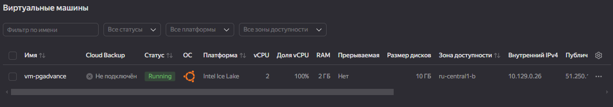
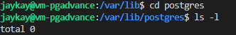
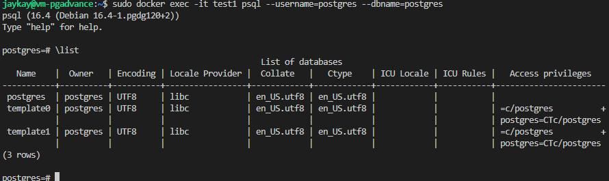
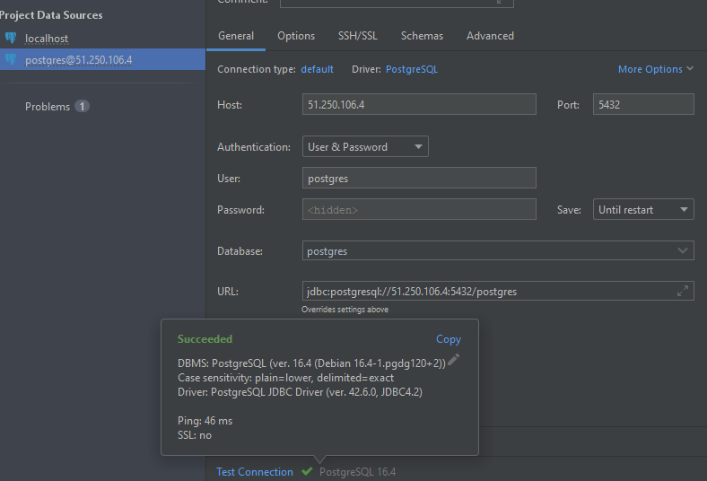
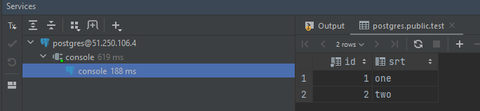
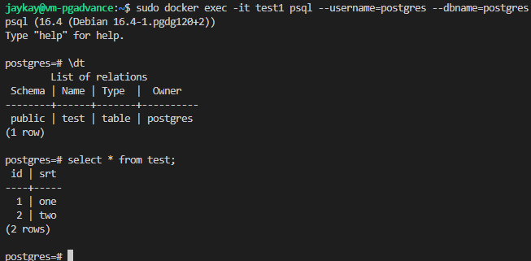
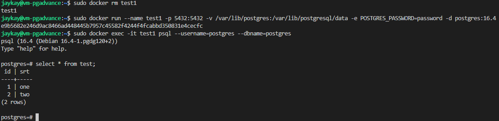
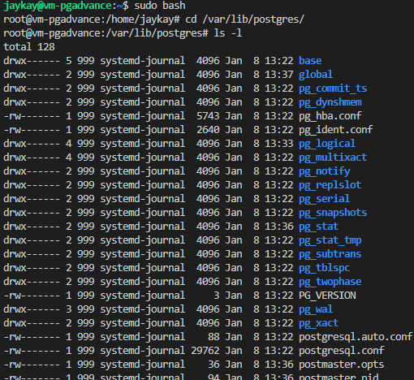

1. Создание VM
    - 2 cpu 2 GB
    - ubuntu
    - публичный доступ
    - доступ по ssh, указать логин



2. Подготока для установки docker
    - sudo apt update
    - sudo apt install curl software-properties-common ca-certificates apt-transport-https -y
    - wget -O- https://download.docker.com/linux/ubuntu/gpg | gpg --dearmor | sudo tee /etc/apt/keyrings/docker.gpg > /dev/null
    - echo "deb [arch=amd64 signed-by=/etc/apt/keyrings/docker.gpg] https://download.docker.com/linux/ubuntu jammy stable"| sudo tee /etc/apt/sources.list.d/docker.list > /dev/null
    - sudo apt update
    
3. Установка docker
    - sudo apt install docker-ce -y
    - Проверка что все ок sudo systemctl status docker
    
4. Установка docker compose
    - sudo apt-get install git
    - git clone https://github.com/docker/compose.git

5. Создать каталог `jaykay@vm-pgadvance:/var/lib$ sudo mkdir postgres`

    

6. Создание и запуск контейнера 

    `sudo docker run --name test1 -p 5432:5432 -v /var/lib/postgres:/var/lib/postgresql/data -e POSTGRES_PASSWORD=password -d postgres:16.4`

7. Подключение к postgres
    - через psql `sudo docker exec -it test1 psql --username=postgres --dbname=postgres`

    
    - через IDE

    

8. Создание таблицы с данными
    ```
    CREATE TABLE test (id  serial, srt text );
    INSERT INTO test(srt) VALUES ('one'), ('two');
    SELECT * FROM test;
    ```
    

    

9. Остановить контейнер - `sudo docker stop test1`
    Удалить контейнер `sudo docker rm test1`

10. Создать заново, подключится снова и проверить, что данные остались на месте

    

11. Каталог /var/lib/postgres/

