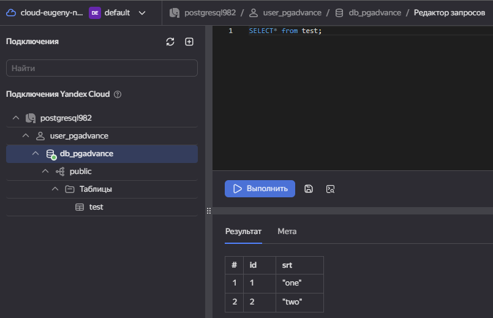
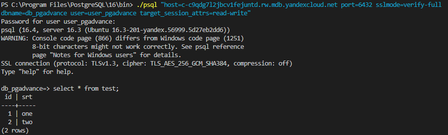

1. Выдал роль vpc.user и роль managed-postgresql.editor пользователю своего аккаунта.
2. "Все сервисы" -> "Managed Service for PostgreSQL" -> "Создать кластер":
    - Платформа - intel ice lake
    - Тип - cpu-optimized
    - 2 cores | 4 GB
    - network-hdd 10GB
    - Хосты - один с публичным доступом
3. Подключение с помощью WebSQL
    - Добавить подключение 
    
4. Подключение с помощью psql
    - Добавить сертификат - `mkdir $HOME\.postgresql; curl.exe -o $HOME\.postgresql\root.crt https://storage.yandexcloud.net/cloud-certs/CA.pem`
    - Подключение `psql "host=c-c9qdg7l2jbcv1fejuntd.rw.mdb.yandexcloud.net port=6432 sslmode=verify-full  dbname=db_pgadvance user=user_pgadvance target_session_attrs=read-write"`
    
