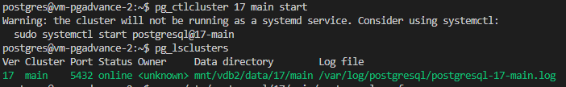

1. Создание VM
    - 2 cpu 2 GB
    - ubuntu
    - публичный доступ
    - доступ по ssh, указать логин

    

2. sudo apt install postgresql 

    

3. Создать таблицу с данными

    

4. Остановка postgres

    

5. Создайте новый диск

    

6. Примонтировать к ВМ

    

7. проинициализируйте диск согласно инструкции - https://yandex.cloud/ru/docs/compute/operations/vm-control/vm-attach-disk

    

8. сделайте пользователя postgres владельцем

    

9. перенесите содержимое

    

10. попытайтесь запустить кластер

    

11. Поменять в конфигурационном файле путь в параметре "data_directory" на новый.
    `data_directory = 'mnt/new_disk/data/17/main'`

12. Запустить postgres

    

13. Проверить содержимое ранее созданной таблицы

    

Задание со звездочкой

1. Создал новую ВМ
2. Установил на нее postgresql
3. Остановил postgresql, удалил /var/lib/postgresql/17
4. Зайти на старую ВМ, остановить postgresql
5. Отсоединить диск от старой ВМ и присоединить к новой
6. Смонтируйте разделы диска на новой ВМ 
    ```
    sudo mkdir /mnt/vdb2 
    sudo mount /dev/vdb1 /mnt/vdb2
    ```
    

7. Поменять в конфигурационном файле путь в параметре "data_directory" на новый.
    `data_directory = 'mnt/vdb2/data/17/main'`
8. Запустить postgresql

    

9. Проверить содержимое ранее созданной таблицы

    
    