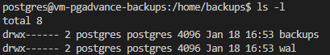
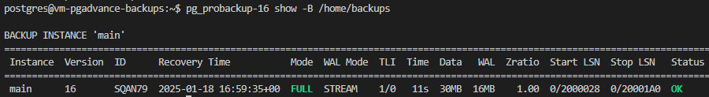
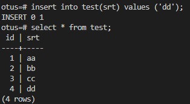
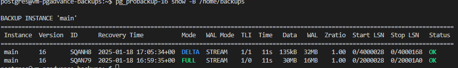
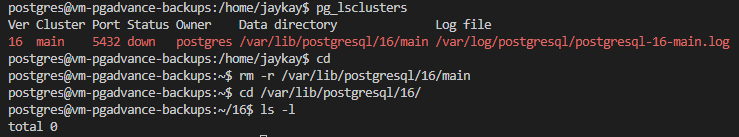
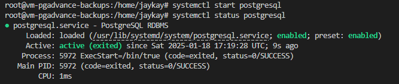
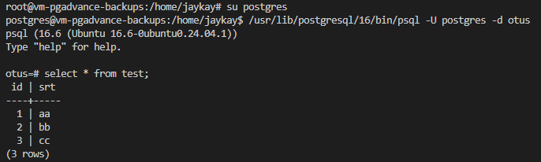
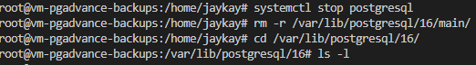
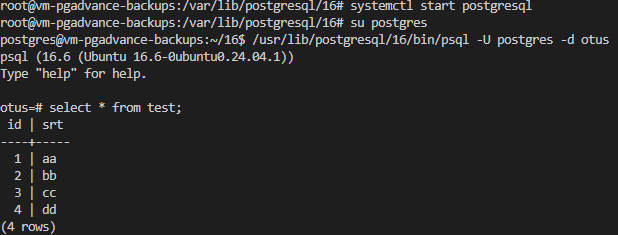

1. Установка postgres - `sudo apt install postgresql`
2. Установка pg_probackup
    - Добавить ключ GPG репозитория pg_probackup
    ```
    sudo apt install gpg wget
    wget -qO - https://repo.postgrespro.ru/pg_probackup/keys/GPG-KEY-PG-PROBACKUP | \
    sudo tee /etc/apt/trusted.gpg.d/pg_probackup.asc
    ```
    - Настройка репозиторий бинарных пакетов
    ```
    . /etc/os-release
    echo "deb [arch=amd64] https://repo.postgrespro.ru/pg_probackup/deb $VERSION_CODENAME main-$VERSION_CODENAME" | \
    sudo tee /etc/apt/sources.list.d/pg_probackup.list
    ```
    - Настройка репозиторий исходных пакетов для пересборки двоичных файлов.
    ```
    echo "deb-src [arch=amd64] https://repo.postgrespro.ru/pg_probackup/deb $VERSION_CODENAME main-$VERSION_CODENAME" | \
    sudo tee -a /etc/apt/sources.list.d/pg_probackup.list
    ```
    - Установка pg_probackup 
    ```
    sudo apt update
    sudo apt install pg-probackup-16
    ```
3. Создаем каталог для хранения резервных копий `sudo mkdir /home/backups && sudo chmod 777 /home/backups`

    

4. Инициализируем созданный каталог как каталог для бакапов: `pg_probackup-16 init -B /home/backups`

    

5. Инициализируем инстанс кластера по его пути и назовем его 'main' и определим что он будет хранить бакапы по выбранному пути
    `pg_probackup-16 add-instance --instance 'main' -D /var/lib/postgresql/16/main -B /home/backups`
6. Создадим новую базу данных - `CREATE DATABASE otus;`
7. Создадим таблицу в этой бд и заполним ее тестовыми данными
    ```
    create table test(id serial, srt text);
    insert into (srt) values ('aa'),('bb'),('cc');
    ```
8. Делаем FULL бэкап - `pg_probackup-16 backup --instance 'main' -b FULL --stream --temp-slot -B /home/backups`

    

9. Добавили данных в таблицу 

    

10. Делаем инкрементальную копию - `pg_probackup-16 backup --instance 'main' -b DELTA --stream --temp-slot -B /home/backups`

    

11. Останавливаем postgresql - `systemctl stop postgresql`.
    Чистим кластер - `rm -r /var/lib/postgresql/16/main`

    

12. Восстанавливаемся из FULL бэкапа (SQAN79)
    ` pg_probackup-16 restore --instance 'main' -i 'SQAN79' -D /var/lib/postgresql/16/main -B /home/backups`

13. Запускаем postgresql

    

14. Проверяем данные в бд

    

15. Останавливаем postgresql и чистим кластер

    

16. Восстанавливаемся из DELTA бэкапа
    `pg_probackup-16 restore --instance 'main' -i 'SQANH8' -D /var/lib/postgresql/16/main -B /home/backups`
    Запускаем postgresql и подключаемся к БД

    