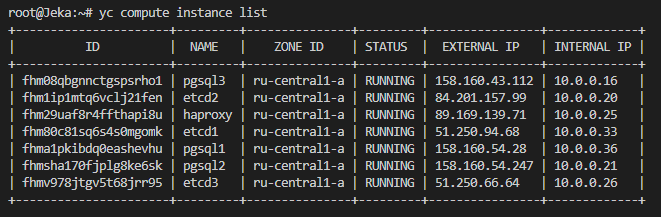
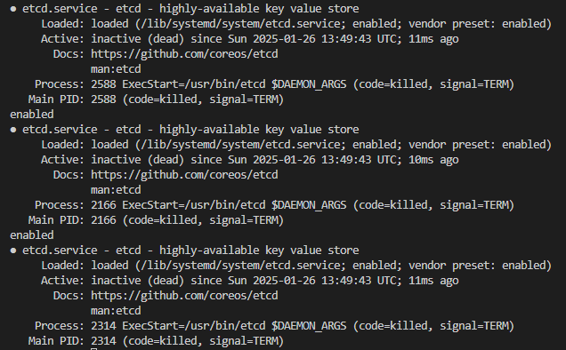
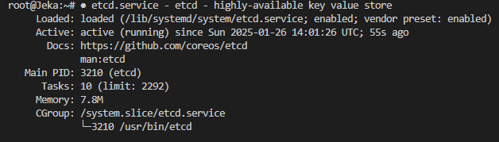
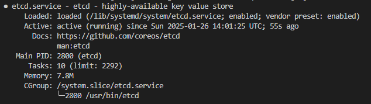
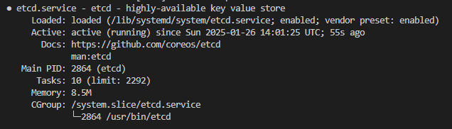
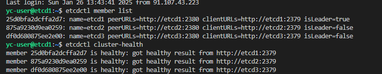
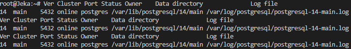
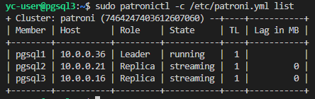

1. Создать 3 ВМ для Postgres, 3 ВМ для etcd и 1 ВМ для haproxy
    

2. Прописываем хосты в каждой ВМ

3. Установка ETCD на ВМ:
    - останавливаем исмотрим статусы
    
    - обновляем файл конфигурации
    - запускаем ETCD

    
    
    
    

4. Установка PostgreSQL на ВМ
    

5. Установка Patroni на ВМ с postgres:
    - установить библиотеки для python
    - остановить postgres, удалить кластер
    - установить patroni[etcd]
    - закинуть файл конфигурации patroni коастера на ноды с postgresql
    - на всех нодах необходимо создать папку для хранения файлов и назначить ей нужные права, в нашем случае это /mnt/patroni.

6. Инициализация Patroni
    - Перегрузить ВМ на которых установлен patroni
    - запускаем patroni на нодах
    
    

