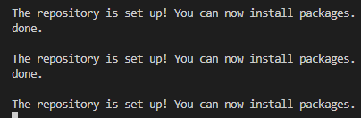

1. Создаем инфраструктуру:
  
  `yc vpc network create --name citus-net --description "citus-net"`

  
  
  `yc vpc subnet create --name citus-subnet --range 10.0.0.0/24 --network-name citus-net --description  "citus-subnet"`

  

  ```
  yc dns zone create --name citus-dns \
    --zone staging. \
    --private-visibility network-ids=enpcmsg3b63q17651v7o
  ```
  

-- Развернем 3 ВМ для PostgreSQL:
```
for i in {1..2}; do yc compute instance create \
  --name node-$i \
  --hostname node-$i \
  --cores 2 \
  --memory 4 \
  --create-boot-disk size=10G,type=network-hdd,image-folder-id=standard-images,image-family=ubuntu-2004-lts \
  --network-interface subnet-name=citus-subnet,nat-ip-version=ipv4 \
  --ssh-key ~/.ssh/ycssh.pub & done;
```
```
yc compute instance create \
  --name coordinator \
  --hostname coordinator \
  --cores 2 \
  --memory 4 \
  --create-boot-disk size=10G,type=network-hdd,image-folder-id=standard-images,image-family=ubuntu-2004-lts \
  --network-interface subnet-name=citus-subnet,nat-ip-version=ipv4 \
  --ssh-key ~/.ssh/ycssh.pub
```
  

-- Прописываем хосты в каждой ВМ:
```
for i in {1..2}; do vm_ip_address=$(yc compute instance show --name node-$i | grep -E ' +address' | tail -n 1 | awk '{print $2}') && ssh -o StrictHostKeyChecking=no -i ~/.ssh/ycssh yc-user@$vm_ip_address <<EOF
sudo bash -c 'cat >> /etc/hosts <<EOL
10.0.0.7 coordinator
10.0.0.17 node-1
10.0.0.5 node-2
EOL
'
EOF
done;
```

2. Установка postgresql с расширением citus
    
  - Устанавливаем citus на все машины:
```
for i in {1..2}; \
do vm_ip_address=$(yc compute instance show \--name node-$i | grep -E ' +address' | tail -n 1 | awk '{print $2}') \
&& ssh -o StrictHostKeyChecking=no -i ~/.ssh/ycssh yc-user@$vm_ip_address \
'sudo apt update && sudo DEBIAN_FRONTEND=noninteractive apt upgrade -y -q && curl https://install.citusdata.com/community/deb.sh | sudo bash' \
& done;
```
    


```
for i in {1..2}; \
do vm_ip_address=$(yc compute instance show \--name node-$i | grep -E ' +address' | tail -n 1 | awk '{print $2}') \
&& ssh -o StrictHostKeyChecking=no -i ~/.ssh/ycssh yc-user@$vm_ip_address \
'sudo DEBIAN_FRONTEND=noninteractive apt -y install postgresql-17-citus-13.0' \
& done;
```  


- Добавим citus в hared_preload_libraries:

```
for i in {1..2}; \
do vm_ip_address=$(yc compute instance show \--name node-$i | grep -E ' +address' | tail -n 1 | awk '{print $2}') \
&& ssh -o StrictHostKeyChecking=no -i ~/.ssh/ycssh yc-user@$vm_ip_address \
'sudo pg_conftool 17 main set shared_preload_libraries citus && sudo pg_conftool 17 main set listen_addresses '*' && sudo pg_conftool 17 main set wal_level logical' \
& done;
```
- Настроим доступ к базе, открыть доступ, указав необходимые адреса в /etc/postgresql/17/main/pg_hba.conf

```
for i in {1..2}; \
do vm_ip_address=$(yc compute instance show \--name node-$i | grep -E ' +address' | tail -n 1 | awk '{print $2}') \
&& ssh -o StrictHostKeyChecking=no -i ~/.ssh/ycssh yc-user@$vm_ip_address \
'sudo service postgresql restart && sudo update-rc.d postgresql enable' \
& done;
```
--Для координатора повторяем аналогичные действия

3. На всех нодах:
    - Создаем БД `CREATE DATABASE citus;`
    - В созданной БД добавляем расширение `CREATE EXTENSION citus;`

4. На координаторе:

- Устанавливаем координатора, добавляем узлы 
```
SELECT citus_set_coordinator_host('10.0.0.7', 5432);
SELECT * FROM citus_add_node('10.0.0.17', 5432);
SELECT * FROM citus_add_node('10.0.0.5', 5432);
```
- Создаем таблицу
```
CREATE TABLE sales (
  region         varchar(500),
  country        varchar(500),
  item_type      varchar(500),
  sales_channel  varchar(500),
  order_priority varchar(500),
  order_date     varchar(10),
  order_id       bigserial,
  ship_date      varchar(10),
  units_sold     bigint,
  units_price    real,
  units_cost     real,
  total_revenue  double precision,
  total_cost     double precision,
  total_profit   double precision
);
ALTER TABLE sales
  OWNER TO postgres;
```
- Определяет распределённую таблицу и создаёт её сегменты `SELECT create_distributed_table('sales', 'order_id');`

5. Создание одиночного инстанса БД

- Создаем подсеть 
```
yc vpc subnet create \
    --name citus-subnet2 \
    --range 172.16.0.0/24 \
    --network-name citus-net \
    --description "citus-subnet2" \
    --zone ru-central1-d
```
- Создаем ВМ
```
yc compute instance create \
  --name single \
  --hostname single \
  --zone ru-central1-d \
  --cores 2 \
  --memory 4 \
  --create-boot-disk size=10G,type=network-hdd,image-folder-id=standard-images,image-family=ubuntu-2004-lts \
  --network-interface subnet-name=citus-subnet2,nat-ip-version=ipv4 \
  --ssh-key ~/.ssh/ycssh.pub
```
- Устанавливаем БД
```
 vm_ip_address=$(yc compute instance show --name single | grep -E ' +address' | tail -n 1 | awk '{print $2}') \
  && ssh -o StrictHostKeyChecking=no -i ~/.ssh/ycssh yc-user@$vm_ip_address \
  'sudo apt update && sudo apt upgrade -y -q && echo "deb http://apt.postgresql.org/pub/repos/apt $(lsb_release -cs)-pgdg main" | sudo tee -a /etc/apt/sources.list.d/pgdg.list && wget --quiet -O - https://www.postgresql.org/media/keys/ACCC4CF8.asc | sudo apt-key add - && sudo apt-get update && sudo apt -y install postgresql-17'
```
- Создаем таблицу
```
CREATE TABLE sales (
  region         varchar(500),
  country        varchar(500),
  item_type      varchar(500),
  sales_channel  varchar(500),
  order_priority varchar(500),
  order_date     varchar(10),
  order_id       bigserial,
  ship_date      varchar(10),
  units_sold     bigint,
  units_price    real,
  units_cost     real,
  total_revenue  double precision,
  total_cost     double precision,
  total_profit   double precision
);
ALTER TABLE sales
  OWNER TO postgres;
```
6. Загрузить в распределенный кластер данных из - https://excelbianalytics.com/wp/downloads-18-sample-csv-files-data-sets-for-testing-sales/ (5m Sales Records). Аналогично сделать для одиночного кластера PostgreSQL.

`EXPLAIN ANALYZE SELECT count(*) FROM sales;`
- citus

- single Postgres (JIT)

- single Postgres (без JIT)

```
EXPLAIN ANALYZE
SELECT
  country,
  sum(total_revenue),
  sum(total_cost),
  sum(total_profit)
FROM sales
GROUP BY country
ORDER BY country;
```
- citus

- single Postgres (JIT)

- single Postgres (без JIT)

```
EXPLAIN ANALYZE
SELECT
  item_type,
  sum(units_sold),
  max(units_price),
  max(units_cost),
  min(units_price),
  min(units_cost)
FROM sales
GROUP BY item_type
ORDER BY item_type DESC;
```
- citus

- single Postgres (JIT)

- single Postgres (без JIT)
