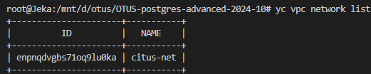

1. Создаем инфраструктуру:

    
    
    

2. Установка postgresql с расширением citus
    
    - Устанавливаем citus на все машины:
```
for i in {1..3}; \
do vm_ip_address=$(yc compute instance show \--name node-$i | grep -E ' +address' | tail -n 1 | awk '{print $2}') \
&& ssh -o StrictHostKeyChecking=no -i ~/.ssh/ycssh yc-user@$vm_ip_address \
'sudo apt update && sudo DEBIAN_FRONTEND=noninteractive apt upgrade -y -q && curl https://install.citusdata.com/community/deb.sh | sudo bash' \
& done;
```
    


```
for i in {1..3}; \
do vm_ip_address=$(yc compute instance show \--name node-$i | grep -E ' +address' | tail -n 1 | awk '{print $2}') \
&& ssh -o StrictHostKeyChecking=no -i ~/.ssh/ycssh yc-user@$vm_ip_address \
'sudo DEBIAN_FRONTEND=noninteractive apt -y install postgresql-17-citus-13.0' \
& done;
```  


    - Добавим citus в shared_preload_libraries:
```
for i in {1..3}; \
do vm_ip_address=$(yc compute instance show \--name node-$i | grep -E ' +address' | tail -n 1 | awk '{print $2}') \
&& ssh -o StrictHostKeyChecking=no -i ~/.ssh/ycssh yc-user@$vm_ip_address \
'sudo pg_conftool 17 main set shared_preload_libraries citus' \
& done;
```
    - Настроим доступ к базе
```
for i in {1..3}; \
do vm_ip_address=$(yc compute instance show \--name node-$i | grep -E ' +address' | tail -n 1 | awk '{print $2}') \
&& ssh -o StrictHostKeyChecking=no -i ~/.ssh/ycssh yc-user@$vm_ip_address \
'sudo pg_conftool 17 main set listen_addresses '*' ' \
& done;
```
    Открыть доступ, указав необходимые адреса в /etc/postgresql/17/main/pg_hba.conf
```
for i in {1..3}; \
do vm_ip_address=$(yc compute instance show \--name node-$i | grep -E ' +address' | tail -n 1 | awk '{print $2}') \
&& ssh -o StrictHostKeyChecking=no -i ~/.ssh/ycssh yc-user@$vm_ip_address \
'sudo service postgresql restart && sudo update-rc.d postgresql enable' \
& done;
```

